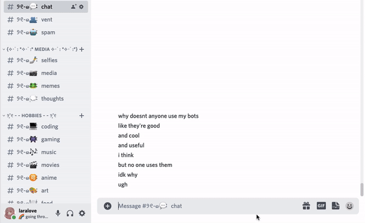

# interchannel message mover
  

imagine you're depressed and you vent.. but then you realize you did it in #general.. or imagine people in your server talk about anime in the #games channel.. unacceptable! and you have to copy every message to the right channel and delete the messages and all.. doesn't it get tiring?

well now there's a solution! think of me like a truck, you call me with a command, i come, pick up the messages, go to whichever channel you want me to go, and drop the messages there! all in a second! and the best part is.. i don't run on fuel!

no mods around? no problem, as long as everyone in the conversation agrees to move the messages, i'll still move them! no need to bother them mods.. or wait for them

## commands
### /move_last_messages [message_count] [channel]
moves the last `message_count` messages (up to 20 messages) to the `channel` you pick.. simple as that!

## nerdy stuff
made with [rust](https://www.rust-lang.org) and [twilight](https://github.com/twilight-rs/twilight)

*made by me (laralove143), licensed MIT*
